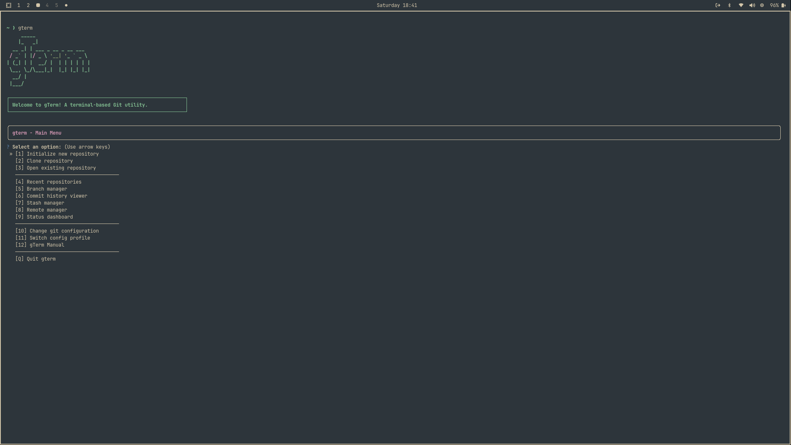
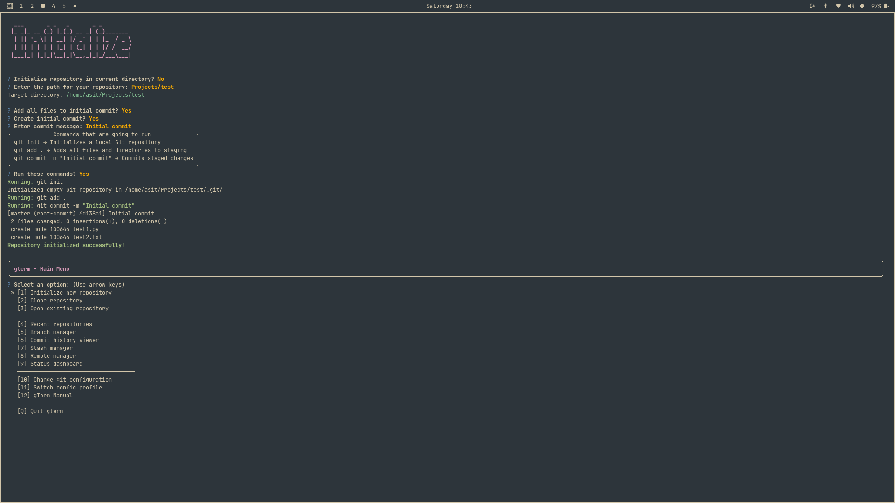
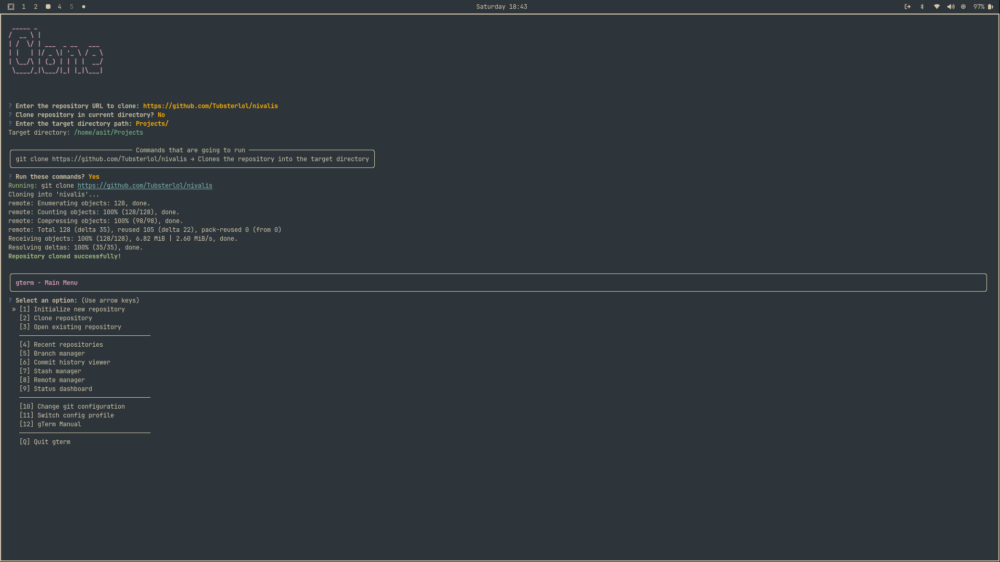
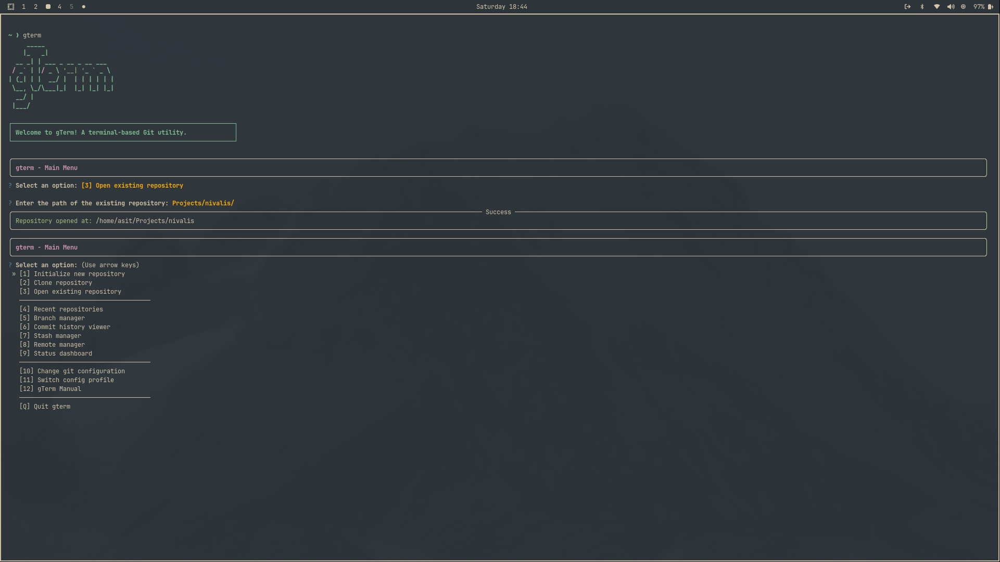
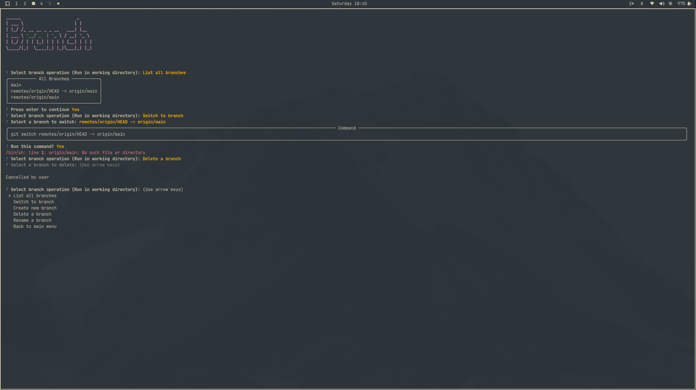

# gTerm — Terminal-Based Git Assistant

<div align="center">

<pre>
     _____                   
    |_   _|                  
  __ _| | ___ _ __ _ __ ___  
 / _` | |/ _ \ '__| '_ ` _ \ 
| (_| | |  __/ |  | | | | | |
 \__, \_/\___|_|  |_| |_| |_|
  __/ |                      
 |___/                       

┌─────────────────────────────────────────────────────────────┐
│                 A terminal-based Git utility.               │
└─────────────────────────────────────────────────────────────┘
</pre>
</div>

gTerm is a professional, open-source terminal user interface (TUI) for Git, designed to make version control intuitive, fast, and accessible from any Linux terminal. Inspired by tools like btop, gTerm offers a menu-driven experience for everyday Git operations, eliminating the need to memorize complex commands.
gterm

# gTerm — Terminal-Based Git Assistant

gTerm is a professional, open-source terminal user interface (TUI) for Git, designed to make version control intuitive, fast, and accessible from any terminal. Inspired by tools like btop, gTerm offers a menu-driven experience for everyday Git operations, eliminating the need to memorize complex commands.

---

## Overview

gTerm simplifies Git workflows with an interactive interface built using [questionary](https://pypi.org/project/questionary/) and [rich](https://pypi.org/project/rich/). It is designed exclusively for Linux, and is suitable for both beginners and advanced users.

Key features include:
- Modular architecture: Each Git operation is implemented in a dedicated Python module (e.g., `clone_repo.py`, `branch_manager.py`, `commit_existing_repo.py`, `commit_history.py`, `config_set.py`, etc.).
- Utility modules: `utils.py` for terminal clearing and `ascii_art.py` for displaying ASCII banners.
- Interactive, menu-driven interface for all major Git tasks.
- Two release versions: a precompiled non-editable binary and a fully open-source version for customization.

---

## Features

- **Clone repositories** interactively
- **Initialize new repositories**
- **Open and inspect existing repositories**
- **Branch management**: create, switch, delete, and list branches
- **Commit changes** with guided prompts
- **View commit history** in a readable format
- **Configure Git settings** (user name, email, profiles)
- **Stash and restore work** (WIP)
- **Remote management** (WIP)
- **Status dashboard** (WIP)
- **Built-in help/manual**
- **Terminal cleaning** after every action for a smooth TUI experience

---


### Linux Installation
```bash
sudo apt update
sudo apt install python3 python3-pip git -y
git clone https://github.com/Tubsterlol/gTerm.git
cd gTerm
pip requirements.txt
```
### Running gTerm
After installation, launch gTerm from your terminal:
```bash
gterm
```

## Usage

gTerm provides a menu-driven interface for all major Git operations. Simply type `gterm` in your terminal and follow the interactive prompts.

### Main Menu Options
- Initialize New Repository
- Clone Repository
- Open Existing Repository
- Recent Repositories
- Branch Manager
- Commit History Viewer
- Stash Manager (WIP)
- Remote Manager (WIP)
- Status Dashboard (WIP)
- Change Git Configuration (WIP)
- Switch Config Profile (WIP)
- gTerm Manual

Each action is confirmed interactively, ensuring safe and transparent Git operations.

---

## Development Philosophy


gTerm is built to be:
- **Terminal-first**: No GUI dependencies, fast startup, and native terminal feel
- **Modular**: Each Git operation is a separate Python file for easy extension
- **Open-source**: Transparent, hackable, and community-driven
- **Linux-only**: Designed and tested exclusively for Linux
- **Intuitive**: Designed for both learning and productivity

Two versions are available:
- **Precompiled release**: For users who want a ready-to-run binary (non-editable)
- **Open-source version**: For those who wish to modify, extend, or contribute

---

## License

gTerm is released under the MIT License. See [LICENSE](LICENSE) for details.

---

## Screenshots

<details>
  <summary><strong>Previews</strong></summary>
  
  
  
  
  
  
</details>

---
